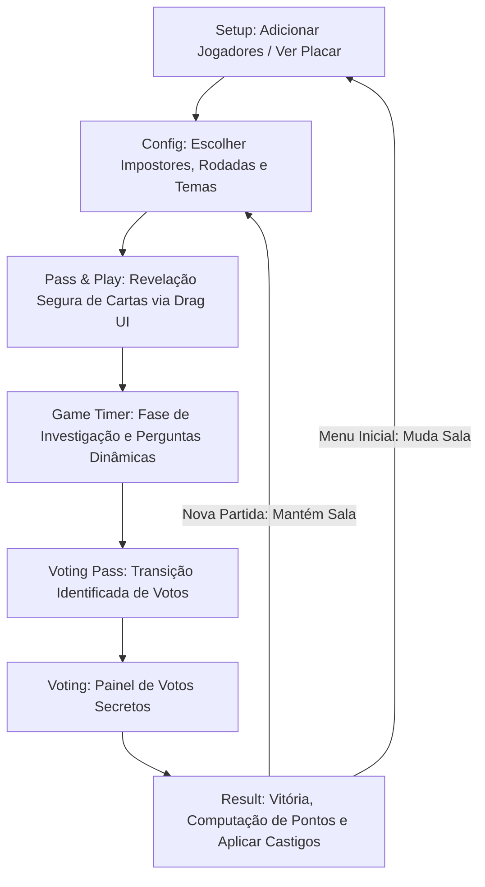

# 🕵️‍♂️ Quem é o Impostor? - Party Game PWA

[](https://vitejs.dev/)
[](https://react.dev/)
[](https://www.typescriptlang.org/)
[](https://tailwindcss.com/)
[](https://motion.dev/)

> **Uma reimaginação premium de jogos de dedução social como *Spyfall* e *Among Us*.** Este é um Progressive Web App (PWA) responsivo e *mobile-first* construído com arquitetura modular, foco em UX física impecável e engenharia de software de ponta para rodar localmente no celular de mão em mão.

---

### [🚀 Veja o App rodando ao vivo](#) *(Cole aqui o link do seu GitHub Pages ou Cloud Run!)*

---

## 💡 O Projeto de Engenharia

Este projeto não é apenas um utilitário recreativo. Ele foi desenvolvido aplicando as melhores práticas de **desenvolvimento Front-end moderno**, com atenção especial a:
* **Mobile-First UX / Gestos Físicos:** Controles gestuais via drag-and-drop com física elástica para ocultar e revelar as palavras, evitando "espiadas" de adversários.
* **Ciclo de Vida de Estado Seguro:** Redução drástica de efeitos colaterais (`useEffect` lineares), manipulação rigorosamente imutável de estados e sincronização nativa assíncrona.
* **Persistência de Sessão Offline (PWA):** Armazenamento em LocalStorage encapsulado para gravar estatísticas, histórico de palavras usadas e ranking geral de forma transparente entre as partidas.
* **CI/CD Escalável:** Pipeline automatizado via GitHub Actions estruturado em múltiplos jobs isolados (Build/Deploy) rodando no Node 24 para ótima performance de compilação.

---

## 🎨 Arquitetura Visual & UI

O design do jogo afasta-se de presets padrão para adotar uma identidade de ficção científica minimalista (**Cosmic Slate Theme**):
* **Tipografia Selecionada:** Inter (Sans-serif) para excelente legibilidade de tabelas de pontos pareada com displays geométricos de impacto para chamadas-chave.
* **Negative Space Dinâmico:** Interfaces sem ruído de bordas ou layouts abarrotados. O jogo foca exclusivamente nas interações táticas do círculo de amigos.
* **Microinterações:** Botões retroalimentados com respostas visuais instantâneas e transições suaves de fluxo via animações em lote da biblioteca `motion/react`.

---

## ⚙️ Fluxo e Máquina de Estados da Aplicação

O fluxo lógico do jogo foi projetado como uma máquina de estados finitos robusta, evitando transições impossíveis e mantendo a integridade dos dados mesmo com ações intempestivas do usuário:



---

## 🕵️‍♂️ Funcionalidades Técnicas Premium

### 1. Sistema Modular de Customização de Papéis
* **O Infiltrado:** Introdução de estado onde um inocente sabota o jogo auxiliando o time vilão (recebe dinamicamente em runtime o array de nomes dos impostores).
* **O Cúmplice:** Implementação algoritmo-dependente de similaridade. O código busca dinamicamente uma palavra vizinha no banco de dados de categorias e atribui ao Cúmplice, criando uma interferência linguística controlada e refinada.

### 2. Tribunal de Votação Autônomo & Antiafeto (Zero State Lag)
Diferente de implementações natas que acumulam atrasos de atualização assíncronas do React (`stale-state`), os dados de voto são encapsulados em dicionários (`Record<string, string>`) e avaliados e propagados imediatamente, garantindo integridade imediata e apuração sem bugs das estatísticas de vitória.

### 3. Gerador Heurístico de Perguntas
Inclui um gerador sob demanda com questões baseadas em quebra de paradigmas ("gerador bizarro") para resolver impasses de debate e motivar jogadores de perfil tímido.

---

## 🛠️ Tecnologias Utilizadas

* **React 18 & Vite:** Tooling ultra veloz, HMR e otimização de bundle final.
* **TypeScript:** Interfaces estritas (`AppState`, `RoleType`, `PlayerSession`) que garantem tipagem estática e evitam quebras de lógica em produção.
* **Tailwind CSS:** Declaração de tokens utilitários puros, animações fluidas e design mobile responsivo com transições de tela suaves.
* **framer-motion (motion/react):** Animações fluidas baseadas em frames dinâmicos e eventos físicos táteis (`drag`).
* **Lucide React:** Coleção polida de ícones baseados em SVG.

---

## 🚀 Como Executar o Projeto Localmente

1. **Clone o repositório:**
   ```bash
   git clone https://github.com/lmarcanjo/Quem---o-impostor.git
   ```

2. **Acesse o diretório do projeto:**
   ```bash
   cd Quem---o-impostor
   ```

3. **Instale os pacotes de dependências:**
   ```bash
   npm install
   ```

4. **Inicie o servidor de desenvolvimento:**
   ```bash
   npm run dev
   ```

5. **Abra o localhost no seu navegador ou use as ferramentas do dispositivo móvel para depurar em modo celular.**

---

## 🧪 Qualidade de Código (Lint & Build)

O projeto mantém níveis rígidos de linting estático para eliminação de memory leaks e loops infinitos de renderização.

Para executar a validação de tipos e testes:
```bash
npm run lint
```
Para gerar a build otimizada de produção:
```bash
npm run build
```

---

## 🧑‍💻 Autor

Desenvolvido por **[Seu Nome Aqui]**.  
*Conecte-se comigo para bater um papo sobre front-end moderno, boas práticas de engenharia de software ou desenvolvimento móvel!*

* 📬 **E-mail:** [lmarcanjo16@gmail.com](mailto:lmarcanjo16@gmail.com)
* 💼 **LinkedIn:** *(Adicione aqui o seu link!)*
* 🌐 **Portfolio de Projetos:** *(Adicione aqui o seu link!)*
